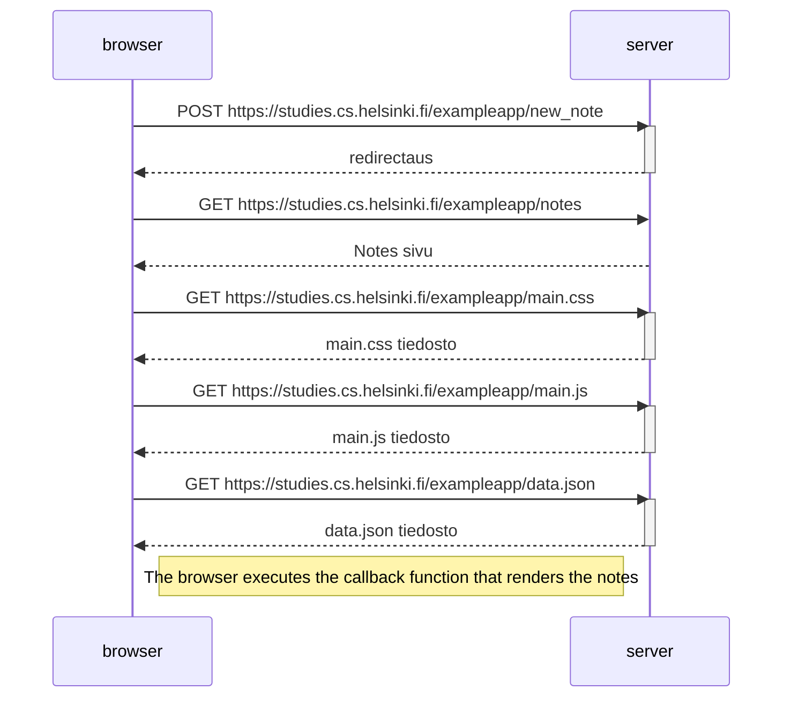

```mermaid
sequenceDiagram
    participant browser
    participant server
    
    browser->>server: POST https://studies.cs.helsinki.fi/exampleapp/new_note
    activate server
    server-->>browser: redirectaus
    deactivate server
    
    browser->>server: GET https://studies.cs.helsinki.fi/exampleapp/notes
    server-->>browser: Notes sivu
    
    browser->>server: GET https://studies.cs.helsinki.fi/exampleapp/main.css
    activate server
    server-->>browser: main.css tiedosto
    deactivate server
    
    browser->>server:  GET https://studies.cs.helsinki.fi/exampleapp/main.js
    activate server
    server-->>browser: main.js tiedosto
    deactivate server

    browser->>server:  GET https://studies.cs.helsinki.fi/exampleapp/data.json
    activate server
    server-->>browser: data.json tiedosto
    deactivate server

    Note right of browser: The browser executes the callback function that renders the notes 
```
